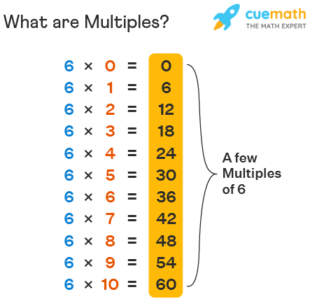

## Multiples

### Problem statement

Read two integer values (A and B). After, the program should print the message "Sao Multiplos" (are multiples) or "Nao sao Multiplos" (aren’t multiples), corresponding to the read values.

### Input
The input has two integer numbers.

### Output
Print the relative message to the input as stated above.

<b>Note:</b>
